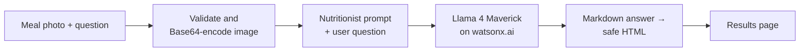

# AI Nutrition Coach

Upload a photo of a meal and the AI Nutrition Coach identifies each food, estimates portion sizes and calories, breaks down protein, carbs, fats, vitamins and minerals, and gives a short health evaluation. It is a small Flask app backed by a vision-language model (Llama 4 Maverick) on IBM watsonx.ai.

> **Origin and credits**
> This project was built while completing the lab *"Building Your First GenAI-Powered Image-Based Web Application: AI Nutrition Coach"* from the **IBM RAG and Agentic AI Professional Certificate** (IBM Skills Network). The base code comes from that lab, which provides it step by step rather than as a repository. I then refactored it into the structure below. The original lab was written by Hailey Quach (other contributor: Ricky Shi), and its content is licensed under Apache 2.0 (see [LICENSE](LICENSE)).

> **Disclaimer:** Calorie and nutrient figures are AI-generated estimates. They can be inaccurate and are not medical or dietary advice.

## How it works



1. **Upload.** The user picks an image and can edit the question (default: *"How many calories are in this food?"*).
2. **Encode.** The file is checked to be a real image (JPEG, PNG, WebP or GIF, up to 10 MB) and Base64-encoded as a data URL.
3. **Prompt.** A fixed nutritionist prompt asks for a six-part answer: identification, portion size and calories per item, total calories, nutrient breakdown, health evaluation, and a disclaimer. The user's question is appended.
4. **Generate.** The image and prompt go to `meta-llama/llama-4-maverick-17b-128e-instruct-fp8` through the watsonx.ai chat API.
5. **Render.** The model's Markdown is converted to HTML, with any raw HTML from the model escaped. It is shown next to the analyzed photo.

## Project structure

```
├── app.py                     # Entry point: parses CLI flags and runs the Flask server
├── nutrition_coach/
│   ├── __init__.py            # create_app() application factory
│   ├── config.py              # Settings (model, credentials, generation params), env-var overrides
│   ├── prompts.py             # Nutritionist system prompt and disclaimer
│   ├── images.py              # Upload validation and Base64 encoding
│   ├── llm.py                 # watsonx.ai vision chat client
│   ├── formatting.py          # Model Markdown → safe HTML
│   ├── routes.py              # GET/POST "/" and error handling
│   ├── templates/index.html   # Page template
│   └── static/                # style.css, app.js (image preview + loading state)
└── tests/                     # Tests with a fake model (no API key needed)
```

## Getting started

Requires Python 3.11.

```bash
python3.11 -m venv my_env
source my_env/bin/activate
pip install -r requirements.txt

python app.py              # http://127.0.0.1:5000
python app.py --debug      # with Flask auto-reload and debugger
```

### Configuration

Inside the IBM Skills Network lab environment no credentials are needed. Anywhere else, set your watsonx.ai credentials as environment variables (see [`.env.example`](.env.example)):

| Variable | Default | Purpose |
| --- | --- | --- |
| `WATSONX_APIKEY` | *(none)* | IBM Cloud API key |
| `WATSONX_PROJECT_ID` | `skills-network` | watsonx.ai project ID |
| `WATSONX_URL` | `https://us-south.ml.cloud.ibm.com` | Regional endpoint |
| `WATSONX_MODEL_ID` | Llama 4 Maverick 17B | Vision chat model |
| `WATSONX_TEMPERATURE`, `WATSONX_TOP_P`, `WATSONX_MAX_TOKENS` | model defaults | Generation parameters |
| `FLASK_SECRET_KEY` | random per run | Signs flash messages |
| `MAX_UPLOAD_MB` | `10` | Upload size limit |

The lab's two exercises map directly onto these settings. For example, `WATSONX_MODEL_ID=ibm/granite-vision-3-2-2b` swaps in IBM Granite Vision (Exercise 1), and the generation variables cover parameter tuning (Exercise 2).

## Tests

```bash
pip install -r requirements-dev.txt
pytest
```

## Tech stack

Flask · IBM watsonx.ai (Llama 4 Maverick) · Pillow · markdown-it-py

## License

Apache 2.0, following the license of the original IBM Skills Network lab content. See [LICENSE](LICENSE).
